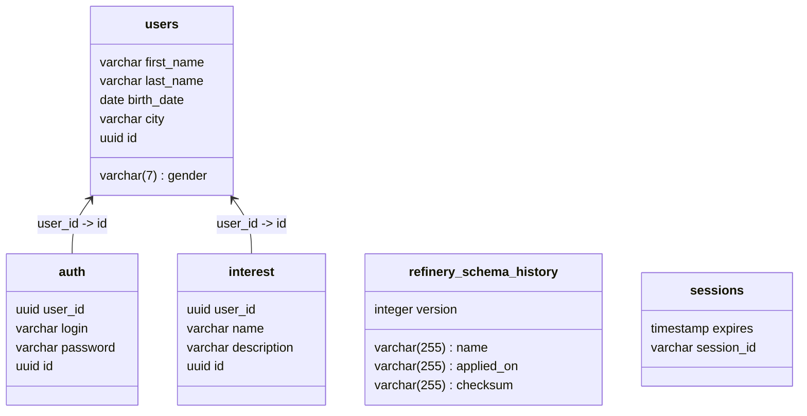

# Blazingly Fast :rocket: Social Network CRUD

Домашнее задание № 1 по курсу Otus Highload Architecture

Небольшой CRUD пользователей абстрактной социальной сети с самописной аутентификацией

## Стек

Rust :rocket:, warp, tokio, sqlx, refinery, PostgresSQL :heart: :fire:

## Запуск

Конфигурация приложения находится в [`/cfg`](./cfg). Стандартной является [`application.yml`](./cfg/application.yml).
Путь до конфигурационного файла можно изменить переменной окружения `CONFIG`

Запросы можно отправлять силами IDE от JetBrains. [Файл с запросами](example.http)

### Локальный :wrench:

1. Устанавливаем Rust через [rustup](https://www.rust-lang.org/tools/install)
2. (Опционально) Меняем секреты в директории [`/secrets`](./secrets)
3. Запускаем PostgresSQL `docker compose up postgres -d`
4. Устанавливаем refinery и sqlx CLI инструменты [`./install-cli.sh`](./install-cli.sh)
5. Прогоняем миграции и подготавливаем метаинформацию по SQL запросам [`./migrate-local.sh`](./migrate-local.sh)
6. Запускаем приложение `cargo run`

Приложение запускается на `0.0.0.0:8080`

### Docker :whale:

1. (Возможно) `docker compose up postgres -d`
2. (Может быть не нужно) `docker compose build social_network`
3. `docker compose up -d`

:smiley: Приложение запускается на `0.0.0.0:8080`

## Известные проблемы

Сессии никогда не удаляются. В PostgresSQL нет нативной поддержки TTL Индексов. 
В более серьезном проекте я бы озадачился партиционированием таблицы и удалением сильно старых экземпляров.

Для сборки требуется запущенная база данных. SQLx использует подход compile-time проверки запросов против существующей схемы.
Из-за этого возникают определенные трудности. Можно игнорировать эту проверку задав переменную окружения `SQLX_OFFLINE=true`

Нет тестов. Тестировать SQLx код достаточно больно, самый простой способ - поднимать базу в Test containers.
Запросы и так проверяются на этапе сборки, а тестировать мне хотелось только логику по аутентификации, так как остальное - скучный CRUD. 
Я немного поисследовал вопрос и оказалось, что [мокировать транзакции к БД достаточно больно](https://github.com/launchbadge/sqlx/issues/1041#issuecomment-2342844789).

Кодовая база в целом написана не очень хорошо, поскольку я впервые использовал данных технологический стек. 
Для первого раза мне кажется вышло неплохо :smiley:

## Методы

### POST /user/register

Создать нового пользователя

#### Пример

_Запрос:_

```json
{
  "credentials": {
    "login": "sir_john",
    "password": "123456"
  },
  "first_name": "John",
  "last_name": "Doe",
  "birth_date": "1980-02-12",
  "gender": "Male",
  "interests": [
    {
      "name": "Books",
      "description": "I enjoy reading books everyday!"
    },
    {
      "name": "Music",
      "description": "I like different kinds of music"
    },
    {
      "name": "Travel",
      "description": "I fancy travel to different locations when I've got free time"
    }
  ],
  "city": "N"
}
```

_Ответ:_

```json
{
  "id": "007347b0-abf3-4c68-9bfd-bb7d76d73506",
  "first_name": "John",
  "last_name": "Doe",
  "birth_date": "1980-02-12",
  "gender": "Male",
  "interests": [
    {
      "name": "Books",
      "description": "I enjoy reading books everyday!"
    },
    {
      "name": "Music",
      "description": "I like different kinds of music"
    },
    {
      "name": "Travel",
      "description": "I fancy travel to different locations when I've got free time"
    }
  ],
  "city": "N"
}
```

### POST /login

Аутентифицироваться и получить идентификатор сессии

#### Пример

_Запрос:_

```json
{
  "credentials": {
    "login": "sir_john",
    "password": "123456"
  }
}
```

_Ответ:_

```json
{
  "session_id": "a6855aa1-075b-441f-8756-5ecf2a9b23a7",
  "expires": "2024-09-14T14:06:05.096176584Z"
}
```

### GET /user/get/{user_id}

Получить пользователя по его ID. ID генерируется на этапе регистрации. 
Можно сделать метод поиска по логину, так как он тоже уникален, но я не стал :frowning:

Для метода требуется аутентификация.
Указывается в виде заголовка `Authorization: session-id <session_id>`

#### Пример

_Запрос:_

```bash
curl -X GET http://localhost:8080/user/get/007347b0-abf3-4c68-9bfd-bb7d76d73506 \
    -H "Authorization: session-id a6855aa1-075b-441f-8756-5ecf2a9b23a7" | jq
```

_Ответ:_

```json
{
  "id": "007347b0-abf3-4c68-9bfd-bb7d76d73506",
  "first_name": "John",
  "last_name": "Doe",
  "birth_date": "1980-02-12",
  "gender": "Male",
  "interests": [
    {
      "name": "Books",
      "description": "I enjoy reading books everyday!"
    },
    {
      "name": "Music",
      "description": "I like different kinds of music"
    },
    {
      "name": "Travel",
      "description": "I fancy travel to different locations when I've got free time"
    }
  ],
  "city": "N"
}
```

## Миграции

За миграции в проекте отвечает инструмент `refinery`. 
Файлы миграций написаны на чистом SQL и находятся в директории [`migrations`](./migrations)

## ERD

